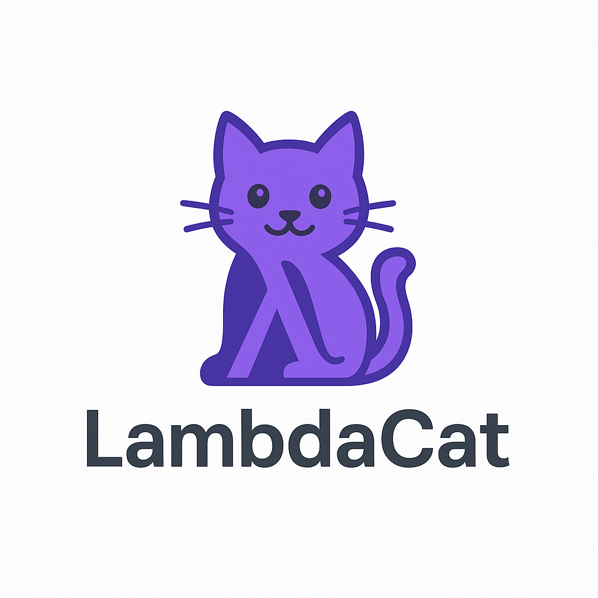

<p align="center">
  
</p>

# 🐾 LambdaCat

> Composable agents on a typed categorical core: objects, functors, naturality, and runtime law checks.

## ✨ Features

- 🤖 Composable agents: typed plan algebra (`sequence`/`parallel`/`choose`), lenses (`focus`) and loops (`loop_while`), strong-monoidal runtime  
- ✅ Object and morphism modeling  
- 🔁 Functors with composition and identity preservation  
- 🌀 Natural transformations with full naturality condition checks  
- 1️⃣ Focused on 1-categories; optional 2-cell diagram rendering via extras  
- 📦 Built-in standard categories: `Δⁿ`, terminal, discrete, walking isomorphism

---

## 🧠 Philosophy

**LambdaCat** is agents framework on a categorical core. Principles:

- 🤖 Build composable agents on top of category core
- ✅ Strong typing and checks across core and agents
- 🧩 Pure, functional modules; orchestration at the edges; small, law‑centric surface
- 🧱 Extras are opt‑in (viz, adapters); core never depends on extras at runtime

Use it for:
- 📐 Research in category theory  
- 🧮 Computational modeling of categorical structures  
- 🧠 Experimental algebraic topology and homotopy  
- 🤖 Categorical foundations for machine learning and AI systems

---

## Why LambdaCat?

- Confidence by construction: executable law checks for categories, functors, and naturality you can run in tests/CI.
- Composability that scales: a strong‑monoidal runtime interprets plans as pipelines; build with `sequence`, `parallel`, `choose`, `focus`, and `loop_while`.
- Small, typed surface: minimal dataclasses and explicit maps; easy to read, reason about, and extend.
- Traceable runs: per‑step timings and optional snapshots for debugging and auditing.
- Diagram‑ready: generate Mermaid graphs for categories, functors, naturality squares, plans, and execution Gantt.
- Zero heavy deps by default: core stays lean; extras/plugins are opt‑in.

---

## 🧮 Type‑theoretic stance

- **Positioning**
  - **λ→ (simply typed)**: core APIs are STLC‑like, pure, and law‑centric.
  - **λ2 (polymorphism)**: parametric generics via `typing`/`TypeVar`; suites enforce identity/associativity/naturality akin to parametricity guarantees.
  - **λω (type operators)**: approximated with Python generics; no higher‑kinded types; we avoid emulation hacks.
  - **λP (dependent types)**: out of scope for Python; we do not simulate dependent typing in core.
- **Implications**
  - **Fail‑fast boundaries**: no ad‑hoc runtime type dispatch in core; keep functions small, pure, and parametric.
  - **Proof surface**: categorical laws are checked by suites; deeper dependent proofs live in external proof assistants (linked from docs if needed).
  - **Scope control**: avoid pseudo‑dependent encodings; if research needs them, they belong in extras/docs, never imported by core.
- **Why this helps**
  - **Clarity** and **maintainability**: communicates boundaries, prevents fragile designs, and keeps the core minimal and law‑centric.

---

## 🛠️ Setup (recommended: editable install)

Create a virtual environment and install the package locally (no publishing required):

```bash
python -m venv .venv
source ./.venv/bin/activate
pip install -U pip
pip install -e .
```

---

## 🚀 Getting Started (Agents)

Minimal agent flow with a runner and evaluator:

```python
from LambdaCat.core.presentation import Formal1
from LambdaCat.agents.eval import Agent

actions = {
  'denoise': lambda s, ctx=None: s.replace('~',''),
  'edges':   lambda s, ctx=None: ''.join(ch for ch in s if ch.isalpha()),
  'segment': lambda s, ctx=None: s.upper(),
  'merge':   lambda s, ctx=None: f"[{s}]",
}

agent = Agent(implementation=actions, evaluator=lambda out: len(out))
plan1 = Formal1(('denoise','merge'))
plan2 = Formal1(('denoise','edges','segment','merge'))

best_plan, report = agent.choose_best([plan1, plan2], "~a~b_c-1")
print(best_plan.factors)  # ('denoise','edges','segment','merge')
print(report.output)      # [ABC]
print(report.score)       # e.g., 5
```

Structured plans with explicit composition and invariants:

```python
from LambdaCat.agents.actions import task, sequence, parallel, choose
from LambdaCat.agents.eval import run_structured_plan

impl = {
  'clean':   lambda s, ctx=None: s.strip(),
  'upper':   lambda s, ctx=None: s.upper(),
  'summ':    lambda s, ctx=None: s,
  'keywords':lambda s, ctx=None: s,
}

plan = sequence(
  task('clean'),
  parallel(task('summ'), task('keywords')),
  choose(task('upper'), task('clean'))
)

report = run_structured_plan(
  plan,
  impl,
  input_value="  hello world  ",
  aggregate_fn=lambda outs: tuple(outs),
  choose_fn=lambda outs: 0,
  snapshot=True,
)
print(report.output)
```

## 📚 Getting Started (Core)

See `docs/getting-started.md`, or run:

```python
from LambdaCat.core.presentation import Obj, ArrowGen, Formal1, Presentation

objects = (Obj("A"), Obj("B"))
arrows = (ArrowGen("f","A","B"),)
pres = Presentation(objects, arrows)
```

## ▶️ Run & Develop

- Quick demo:

```python
from LambdaCat.core.standard import discrete
from LambdaCat.core.ops import identity

Disc = discrete(["A","B"])  # 1-category with only identities
print(Disc.objects)
print(identity("A"))
```

- Optional: run tests (requires `pytest`):

```bash
pytest -q
```

- Optional: type-check and lint (requires `mypy`, `ruff`):

```bash
mypy --strict src
ruff check .
```

- Generate Mermaid diagrams (no install needed):

```python
from LambdaCat.core.standard import simplex, walking_isomorphism, terminal_category, discrete
from LambdaCat.core.functor import FunctorBuilder
from LambdaCat.core.natural import Natural
from LambdaCat.extras.viz_mermaid import render_all, TwoCellView

Delta3 = simplex(3)
Iso    = walking_isomorphism()
Term   = terminal_category()
DiscAB = discrete(["A","B"]) 

F = (FunctorBuilder('F', source=Delta3, target=Iso)
     .on_objects({"0":"A","1":"A","2":"B","3":"B"})
     .on_morphisms({"0->1":"id:A","1->2":"f","2->3":"id:B","0->3":"f"})
     .build())
eta = Natural(source=F, target=F, components={"0":"id:A","1":"id:A","2":"id:B","3":"id:B"})
alpha = TwoCellView('α','X','Y','f','g')

render_all({
  'Delta3': Delta3,
  'Iso': Iso,
  'Terminal': Term,
  'DiscreteAB': DiscAB,
  'F': F,
  'eta': eta,
  'alpha': alpha,
}, out_dir='docs/diagrams')
```

## 🤖 Run the agent

Minimal end-to-end example with a runner and scorer:

```python
from LambdaCat.core.presentation import Formal1
from LambdaCat.agents.eval import Agent

actions = {
  'denoise': lambda s, ctx=None: s.replace('~',''),
  'edges':   lambda s, ctx=None: ''.join(ch for ch in s if ch.isalpha()),
  'segment': lambda s, ctx=None: s.upper(),
  'merge':   lambda s, ctx=None: f"[{s}]",
}

agent = Agent(implementation=actions, evaluator=lambda out: len(out))
plan1 = Formal1(('denoise','merge'))
plan2 = Formal1(('denoise','edges','segment','merge'))

best_plan, report = agent.choose_best([plan1, plan2], "~a~b_c-1")
print(best_plan.factors)  # ('denoise','edges','segment','merge')
print(report.output)      # [ABC]
print(report.score)       # e.g., 5
```

Generate a Mermaid Gantt of the execution trace:

```python
from LambdaCat.extras.viz_mermaid import exec_gantt_mermaid
print(exec_gantt_mermaid(report))
```

## 🤖 Agents (sample)

```python
from LambdaCat.core.presentation import Formal1
from LambdaCat.agents.runtime import strong_monoidal_functor

actions = {
  'denoise': lambda s, ctx=None: s.replace('~',''),
  'edges':   lambda s, ctx=None: ''.join(ch for ch in s if ch.isalpha()),
  'segment': lambda s, ctx=None: s.upper(),
  'merge':   lambda s, ctx=None: f"[{s}]",
}

plan = Formal1(('denoise','edges','segment','merge'))
F = strong_monoidal_functor(actions)
print(F(plan)("~a~b_c-1"))  # -> [ABC]
```

More tutorials and notebooks coming soon.

---

## 🔬 Composable agents (functional algebra)

- Plan algebra (typed, composable)
  - Concepts:
    - **Action**: a pure function `(state) -> state` or `(state, ctx) -> state`.
    - **Task**: a plan leaf that invokes a named action.
    - **Plan**: a tree describing how tasks compose.
  - Nodes:
    - `Task`: run a single named action.
    - `Sequence`: run child plans left-to-right.
    - `Parallel`: run child plans in parallel and aggregate outputs via an explicit `aggregate_fn`.
    - `Choose`: evaluate child plans and select one by an explicit `choose_fn` (or evaluator wiring at the agent layer).
  - Builders: `task(name)`, `sequence(...)`, `parallel(..., aggregate_fn=...)`, `choose(..., choose_fn=...)`.
  - Strict invariants: `Parallel` requires an aggregator; `Choose` requires a chooser.

- Focused transforms with lenses
  - `Lens[S, A]` to zoom into a substate; `focus(lens, plan)` composes inner plans on `A` and lifts back to `S` immutably.

- Loops/recursion
  - `loop_while(predicate, body_plan)` applies `body_plan` while the predicate holds; pure and deterministic.

- Tracing
  - Sequential runs collect per-step timings and optional snapshots.
  - Structured runs return a root-level report for now.


- Decision wiring
  - `Choose` can use an explicit `choose_fn` or an agent-level evaluator to pick branches (no silent defaults).


- Sample usage (sketch)
  
  ```python
  from LambdaCat.agents.actions import task, sequence, parallel, choose  # optional module
  from LambdaCat.agents.eval import run_structured_plan         # optional module

  impl = {
    'clean':   lambda s, ctx=None: s.strip(),
    'upper':   lambda s, ctx=None: s.upper(),
    'summ':    lambda s, ctx=None: s,        # placeholder pure actions
    'keywords':lambda s, ctx=None: s,
  }

  plan = sequence(
    task('clean'),
    parallel(task('summ'), task('keywords')),   # requires aggregate_fn at run time
    choose(task('upper'), task('clean'))   # requires choose_fn at run time
  )

  report = run_structured_plan(
    plan,
    impl,
    input_value="  hello world  ",
    aggregate_fn=lambda outs: tuple(outs),
    choose_fn=lambda outs: 0,  # pick first branch
    snapshot=True,
  )
  print(report.output)
  ```
