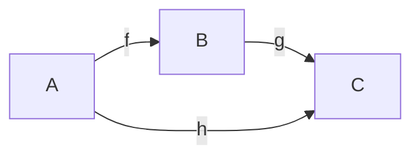
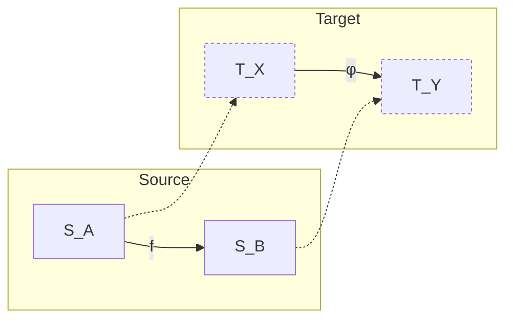
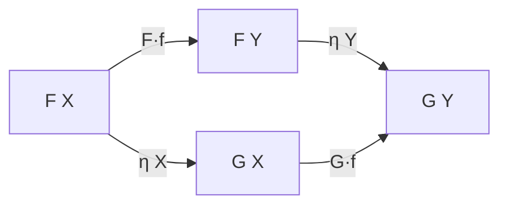
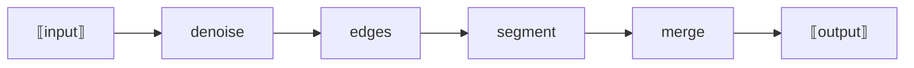

# LambdaCat — Functional Core for Applied Category Theory

> A tiny, law-safe core for categories with optional layers for functors, natural transformations, (strict) 2-cells. Built for practical agent pipelines with mathematical guarantees—without making users learn all of category theory.

---

## TL;DR

* **Core:** immutable `Obj`, `Cat`, explicit `composition` and `identities`, builder helpers, law suites.
* **Structure:** optional plugins later (Tamari/associahedron/MCTS).
* **Agents:** plans as formal words → mapped to real Python callables by a strong-monoidal runtime; scoring + traces; choose best plan.
* **Laws:** extensible law engine → suites for categories; proofs helpers for universal properties.
* **Viz:** automatic **Mermaid** exporters for categories, functors, naturality squares, plans, and execution Gantt.
* **Packaging:** pip-installable core.

---

## Install

Core only (no heavy deps):

```bash
pip install LambdaCat
```

---

## Repository Layout (src layout)

```
src/
  LambdaCat/
    __init__.py
    py.typed
    core/
      __init__.py
      presentation.py     # Obj, ArrowGen, Formal1, Presentation
      category.py         # Cat (identities, composition table)
      builder.py          # obj(), arrow(), build_presentation()
      ops.py              # identity(), compose(), normalize() over Formal1
      functor.py          # FunctorBuilder, CatFunctor (id & comp checks)
      natural.py          # Natural + check_naturality()
      laws.py             # generic law engine (Law, LawSuite, run_suite)
      laws_category.py    # identity + associativity suite for Cat
      laws_functor.py     # functor identities + composition suite (reports)
      standard.py         # terminal, discrete, simplex Δⁿ, walking isomorphism
      ops_category.py     # opposite_category(C)
    extras/
      viz_mermaid.py      # Mermaid exporters + render_all()
    plugins/
      tamari/             # (future)
      ...
    agents/
      __init__.py
      actions.py          # Plan nodes (Task/Sequence/Parallel/Choose/Focus/LoopWhile); builders
      runtime.py          # strong_monoidal_functor; structured plan interpreter
      eval.py             # Agent wrapper (run, choose_best, quick_functor_laws)
```

---

## Core Concepts & API

### Objects, Morphisms, Category

* **Objects**: immutable `Obj(name, data=None)`
* **Arrows (generators)**: immutable `ArrowGen(name, source, target)`
* **Category**: immutable `Cat(objects, arrows, composition, identities)`
* **Compose**: `Cat.compose(g, f)` keyed as `(g,f) ↦ g∘f`
* **Law check**: `run_suite(C, CATEGORY_SUITE)`

### Builder (tiny categories)

```python
from LambdaCat.core.builder import obj, arrow, build_presentation
A = obj("A"); B = obj("B"); f = arrow("f","A","B")
p = build_presentation((A,B),(f,))
```

### Path Ops (syntax-level)

- `identity(obj_name)` → `Formal1(('id:<Obj>',))`
- `compose(*paths)` → concatenated `Formal1`
- `normalize(path)`

### Functors

Map objects and morphisms, preserving identities and composition:

```python
from LambdaCat.core.functor import FunctorBuilder
F = (FunctorBuilder("F", source=C, target=C2)
     .on_objects({"A":"X","B":"Y"})
     .on_morphisms({"f":"φ"})
     .build())
```

### Natural Transformations

Components `η_X : F(X) → G(X)` satisfying naturality squares:

```python
from LambdaCat.core.natural import Natural, check_naturality
eta = Natural(source=F, target=G, components={"A": "id:A", "B": "id:B"})
check_naturality(eta)
```

---

## Extensible Law Engine (Proof-Friendly)

* `Law`, `LawSuite`, `Violation`, `SuiteReport`
* Provided suites:
  * `CATEGORY_SUITE` (identities + associativity)
  * `FUNCTOR_SUITE` (identities + composition)

```python
from LambdaCat.core.laws import run_suite
from LambdaCat.core.laws_category import CATEGORY_SUITE
from LambdaCat.core.laws_functor import FUNCTOR_SUITE
assert run_suite(C, CATEGORY_SUITE).ok
assert run_suite(F, FUNCTOR_SUITE).ok
```

---

## Standard Categories

Helpers for common small categories:

```python
from LambdaCat.core.standard import terminal_category, discrete, simplex, walking_isomorphism
Term  = terminal_category()
Disc  = discrete(["A","B","C"])
Delta = simplex(3)
Iso   = walking_isomorphism()
```

### Category ops

```python
from LambdaCat.core.ops_category import opposite_category
Cop = opposite_category(Delta)
```

---

## Agents (Applied Category Theory)

### Plans as Formal Words

```python
from LambdaCat.core.presentation import Formal1
plan = Formal1(("denoise","edges","segment","merge"))
```

### Strong Monoidal Runtime

Maps plan → pipeline; runs functions with `(x)` or `(x, ctx)` signature.

```python
from LambdaCat.agents.runtime import strong_monoidal_functor
F = strong_monoidal_functor(impl)
out = F(plan)("a..b", ctx={})
```

### Agent Wrapper

Runner + scorer, plus `choose_best` across candidate plans.

```python
from LambdaCat.agents.eval import Agent
agent = Agent(implementation=impl, evaluator=lambda out: quality(out))
best_plan, report = agent.choose_best([plan1, plan2], data)
```

---

## Mermaid Diagrams (Automated)

We emit **Markdown strings** with Mermaid fences for all concepts; you just **paste** them into docs/PRs.

### Generating diagrams (step-by-step)

```python
from LambdaCat.core.standard import simplex, walking_isomorphism, terminal_category, discrete
from LambdaCat.core.functor import FunctorBuilder
from LambdaCat.core.natural import Natural
from LambdaCat.core.presentation import Formal1
from LambdaCat.extras.viz_mermaid import render_all, TwoCellView

Delta3 = simplex(3)
Iso    = walking_isomorphism()
Term   = terminal_category()
DiscAB = discrete(["A","B"]) 

F = (FunctorBuilder('F', source=Delta3, target=Iso)
     .on_objects({"0":"A","1":"A","2":"B","3":"B"})
     .on_morphisms({"0->1":"id:A","1->2":"f","2->3":"id:B","0->3":"f"})
     .build())
eta = Natural(source=F, target=F, components={"0":"id:A","1":"id:A","2":"id:B","3":"id:B"})
plan = Formal1(('denoise','edges','segment','merge'))
alpha = TwoCellView('α','X','Y','f','g')

md_map = render_all({
  'Delta3': Delta3,
  'Iso': Iso,
  'Terminal': Term,
  'DiscreteAB': DiscAB,
  'F': F,
  'eta': eta,
  'Plan': plan,
  'alpha': alpha,
}, out_dir='docs/diagrams')  # omit out_dir to just get strings back
```

Outputs are Markdown files under `docs/diagrams/*.md` with fenced ```mermaid blocks.

### Sample Mermaid Blocks

**Category**



**Functor**



**Naturality**



**Plan**



**Execution Gantt**

```mermaid
%%{init: {'theme': 'base', 'themeVariables': { 'background': '#ffffff', 'primaryTextColor': '#111111', 'textColor': '#111111', 'lineColor': '#111111', 'ganttAxisTextColor': '#111111', 'ganttSectionBkgColor': '#f8fafc', 'ganttSectionBkgColor2': '#ffffff', 'ganttSectionBkgOpacity': 1, 'ganttTaskLineColor': '#111111', 'ganttTaskTextColor': '#111111', 'sectionTextColor': '#111111' }}}%%
gantt
  dateFormat X
  axisFormat %L
  section steps
  denoise  :done, step1, 0, 12
  edges    :done, step2, 12, 24
  segment  :done, step3, 24, 55
  merge    :done, step4, 55, 78
```



---

## Mathematical Confidence (Proof-like Checks)

- Category axioms, functor laws, naturality, universal properties
- Property/meta-morphic tests for robustness

---


## 🔭 Future upgrade: n-categories

- Guiding principles
  - Keep the 1-category core unchanged (`src/LambdaCat/core/{presentation.py, category.py, ops.py, functor.py, natural.py, laws_*.py}`).
  - Add higher-dimensional code in new modules; pure functions only; fail-fast checks.

- Data model (strict n-cats as computads)
  - Generators per dimension (k-cells), boundary maps, and formal composites.
  - Validate boundaries at composition time; no placeholder fallbacks.

- Package layout (new)
  - `src/LambdaCat/core/ncat/`: `presentation_n.py`, `ops_n.py`, `functor_n.py`, `laws_ncategory.py`, `convert_n.py`.

- Laws and checks
  - Suites per k for units/associativity; 2D interchange; aggregate `NCATEGORY_SUITE(n)`.

- Phase 1: strict 2-categories
  - Operations: `vcompose2`, `hcompose2`, whiskering, identities `id2(f)`.
  - Laws: unit/assoc for vertical; functoriality of horizontal; strict interchange.

- Visualization (optional)
  - Extend `extras/viz_mermaid.py` with whiskering/hcomp helpers; extras remain opt-in.

- Testing
  - New tests alongside existing suites (no API breaks); property/meta tests for boundaries.


## Roadmap

1. Ops: product/slice with universal property checkers
2. Plugins: Tamari/associahedron/MCTS search
3. Adapters: natural transformations as action adapters
4. Serialization: stable JSON for plans and small cats
