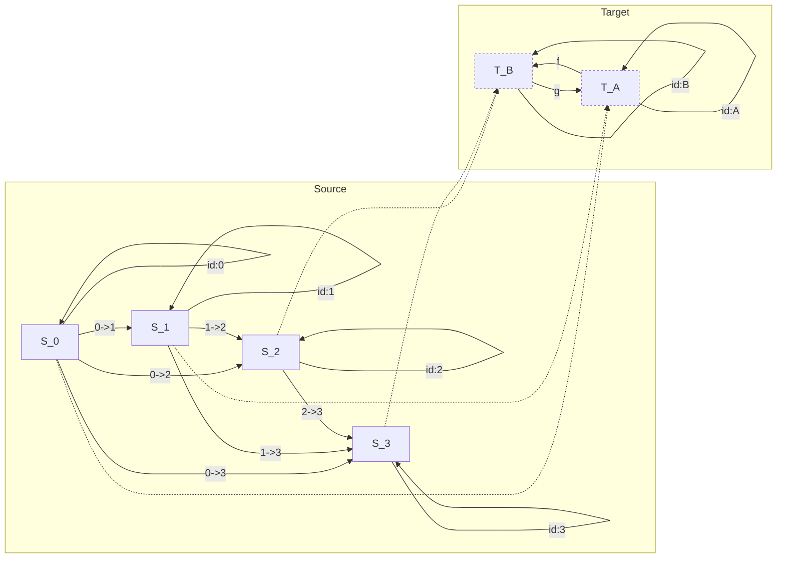

# Functor

```mermaid
graph LR
subgraph Source
  S_0 -- "0->1" --> S_1
  S_0 -- "0->2" --> S_2
  S_0 -- "0->3" --> S_3
  S_1 -- "1->2" --> S_2
  S_1 -- "1->3" --> S_3
  S_2 -- "2->3" --> S_3
  S_0 -- "id:0" --> S_0
  S_1 -- "id:1" --> S_1
  S_2 -- "id:2" --> S_2
  S_3 -- "id:3" --> S_3
end
subgraph Target
  T_A -- "f" --> T_B
  T_B -- "g" --> T_A
  T_A -- "id:A" --> T_A
  T_B -- "id:B" --> T_B
end
  S_0 -.-> T_A:::map
  S_1 -.-> T_A:::map
  S_2 -.-> T_B:::map
  S_3 -.-> T_B:::map
classDef map stroke-dasharray: 3 3;
```