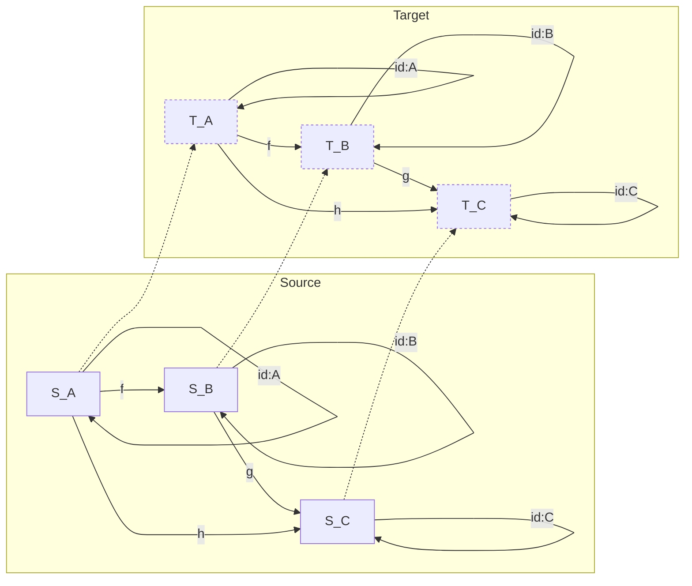

# Functor

```mermaid
graph LR
subgraph Source
  S_A -- "f" --> S_B
  S_B -- "g" --> S_C
  S_A -- "h" --> S_C
  S_A -- "id:A" --> S_A
  S_B -- "id:B" --> S_B
  S_C -- "id:C" --> S_C
end
subgraph Target
  T_A -- "f" --> T_B
  T_B -- "g" --> T_C
  T_A -- "h" --> T_C
  T_A -- "id:A" --> T_A
  T_B -- "id:B" --> T_B
  T_C -- "id:C" --> T_C
end
  S_A -.-> T_A:::map
  S_B -.-> T_B:::map
  S_C -.-> T_C:::map
classDef map stroke-dasharray: 3 3;
```