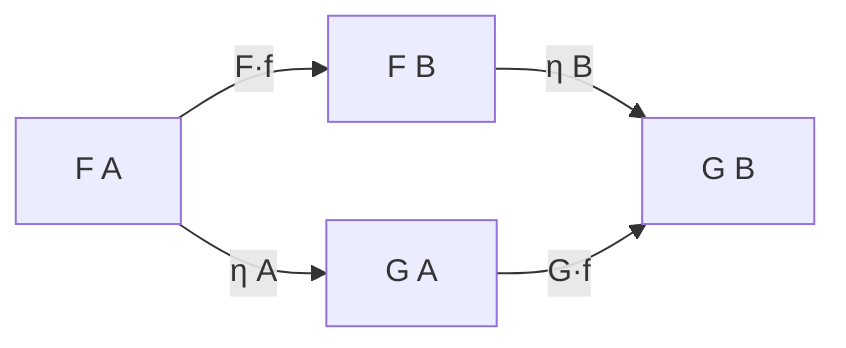
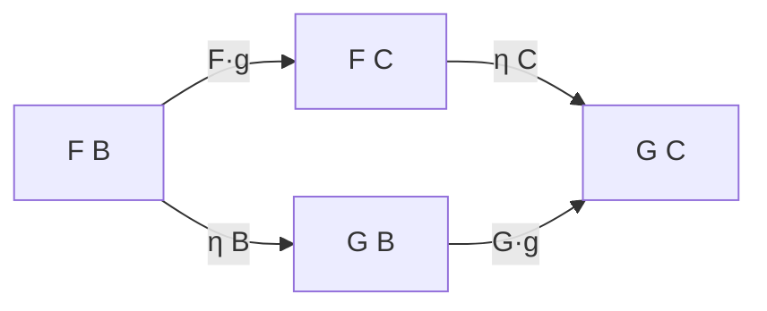
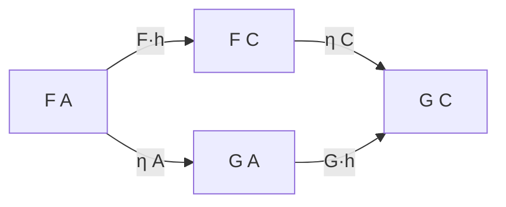
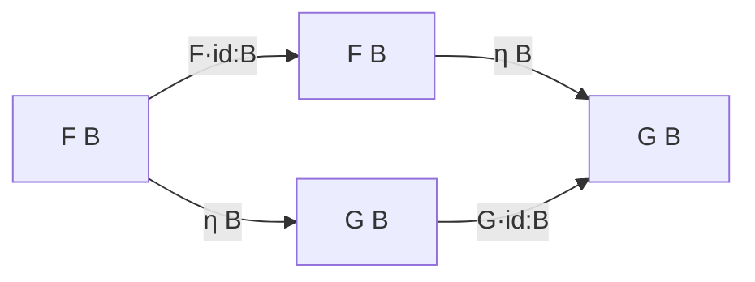
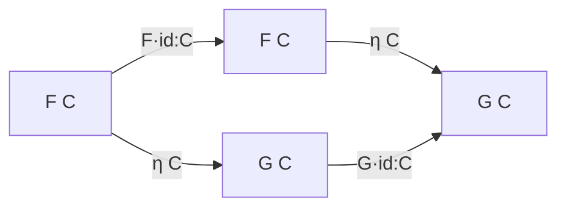

# Natural Transformation

## Naturality on `f`

```mermaid
graph LR
  FX["F A"] -->|F·f| FY["F B"]
  FX -->|η A| GX["G A"]
  FY -->|η B| GY["G B"]
  GX -->|G·f| GY
```

## Naturality on `g`

```mermaid
graph LR
  FX["F B"] -->|F·g| FY["F C"]
  FX -->|η B| GX["G B"]
  FY -->|η C| GY["G C"]
  GX -->|G·g| GY
```

## Naturality on `h`

```mermaid
graph LR
  FX["F A"] -->|F·h| FY["F C"]
  FX -->|η A| GX["G A"]
  FY -->|η C| GY["G C"]
  GX -->|G·h| GY
```

## Naturality on `id:A`

```mermaid
graph LR
  FX["F A"] -->|F·id:A| FY["F A"]
  FX -->|η A| GX["G A"]
  FY -->|η A| GY["G A"]
  GX -->|G·id:A| GY
```

## Naturality on `id:B`

```mermaid
graph LR
  FX["F B"] -->|F·id:B| FY["F B"]
  FX -->|η B| GX["G B"]
  FY -->|η B| GY["G B"]
  GX -->|G·id:B| GY
```

## Naturality on `id:C`

```mermaid
graph LR
  FX["F C"] -->|F·id:C| FY["F C"]
  FX -->|η C| GX["G C"]
  FY -->|η C| GY["G C"]
  GX -->|G·id:C| GY
```