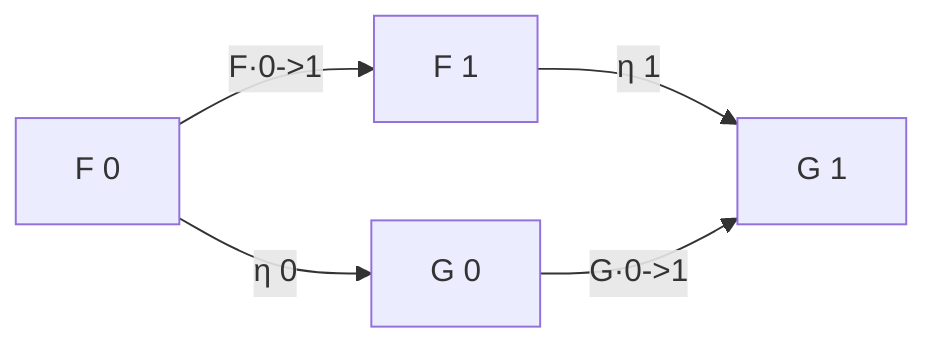
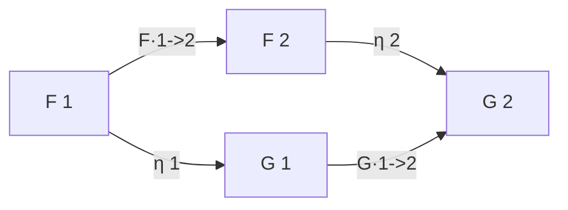
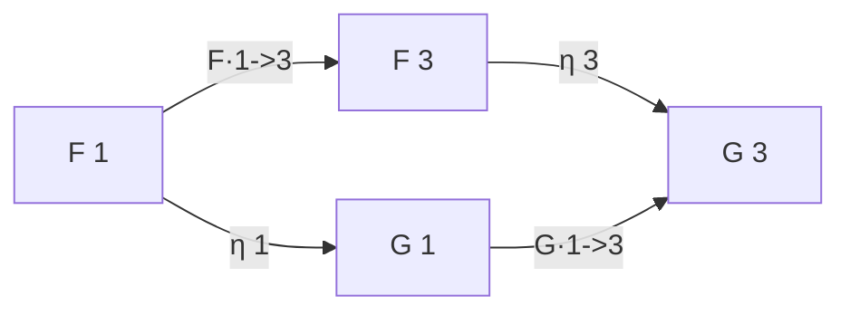
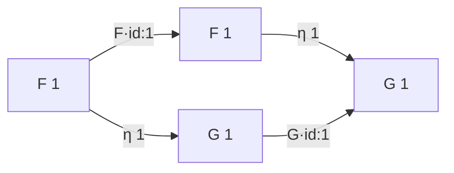
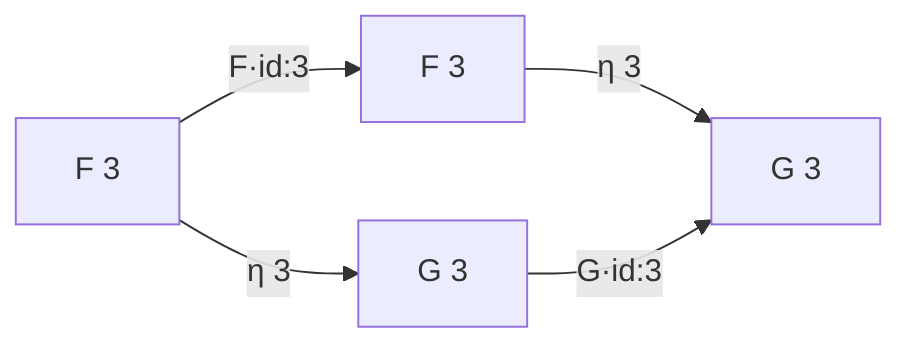

# Natural Transformation

## Naturality on `0->1`

## Naturality on `0->2`

## Naturality on `0->3`

## Naturality on `1->2`

## Naturality on `1->3`

## Naturality on `2->3`

## Naturality on `id:0`

## Naturality on `id:1`

## Naturality on `id:2`

## Naturality on `id:3`

